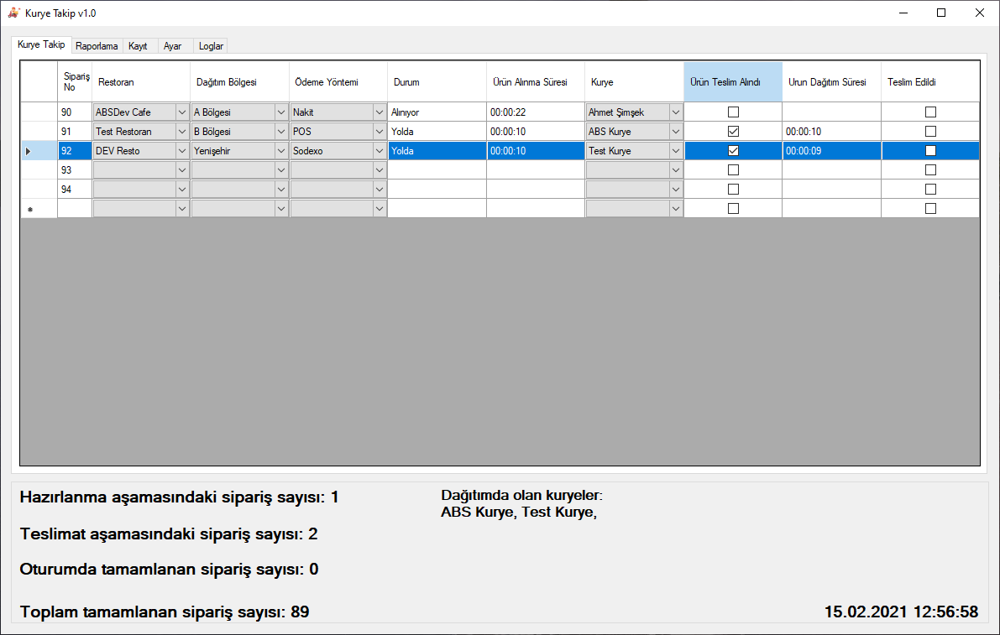
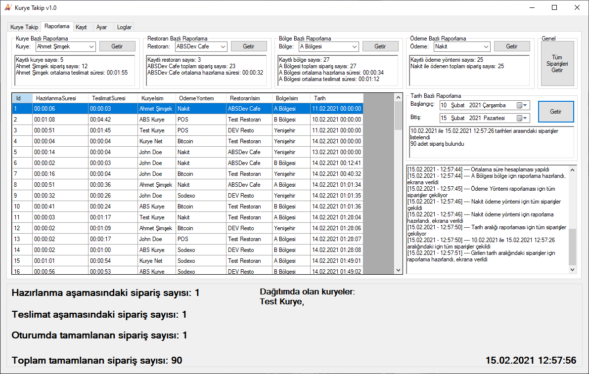
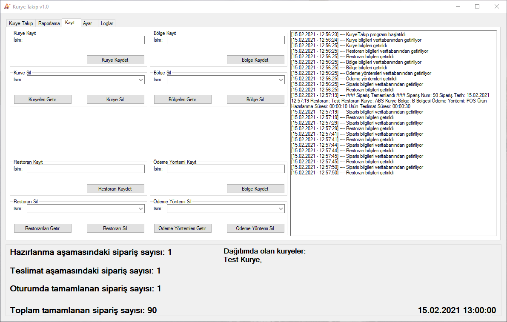
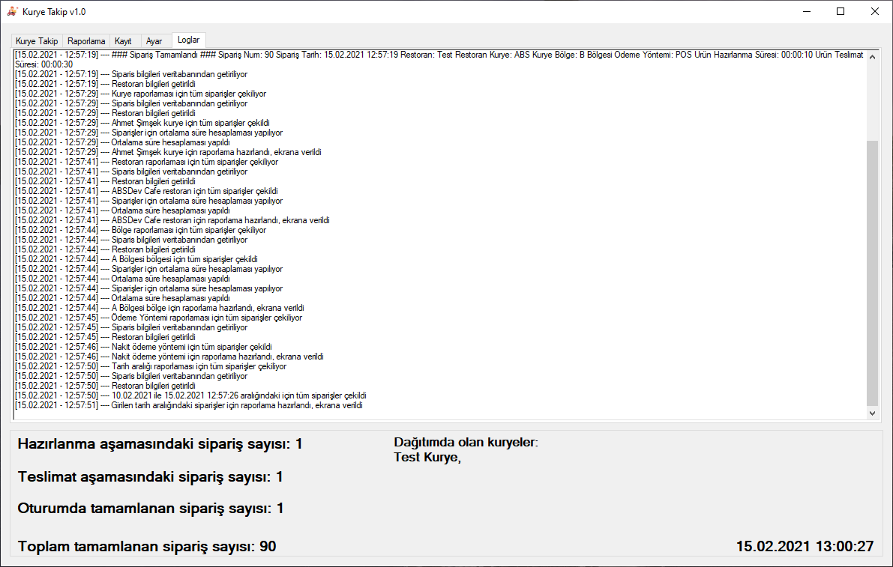

# Kurye Takip Yazılımı [🇹🇷]
Restoran, Bölge, Kurye, Ödeme Yöntemi ve Teslimat süreleri kullanılarak sipariş kaydı yapıp kuryelerin performansının takibinin yapılabileceği kontrol yazılımı.

``` Kullanılan teknolojiler;
- .Net Framework 4.7.2
- Entity Framework
- LINQ
```

Gerekli ön koşullar;
- [.Net Framework 4.7.2](https://support.microsoft.com/tr-tr/topic/microsoft-net-framework-4-7-2-windows-için-çevrimdışı-yükleyici-05a72734-2127-a15d-50cf-daf56d5faec2)
- [SQL Express](https://go.microsoft.com/fwlink/?linkid=866658)
- [SSMS * isteğe bağlı](https://docs.microsoft.com/en-us/sql/ssms/download-sql-server-management-studio-ssms?view=sql-server-ver15)

## Sekmeler
### Kurye Takip
Ekrandaki her bir satır, bir sipariş olarak nitelendirilmektedir.
Sipariş içerisindekiler;
- Id => siparişin özgün tanımlayıcı numarası,
- Restoran => siparişin çıkış restoranı,
- Dağıtım Bölgesi => ürünün teslimat bölgesi,
- Ödeme Yöntemi => sipariş teslimatında yapılacak ödemenin yöntemi (Nakit, POS, Yemek kartı vs.),
- Durum => siparişin durumu 
	- "Alınıyor", 
	- "Yolda",
	- "Tamamlandı"
- Ürün Alınma Süresi => kuryenin ürünü restorandan alma süresi, 
- Kurye => ürünün teslimatını yapacak kurye,
- Ürün Teslim Alındı => kurye ürünü restorandan aldığı zaman işaretlenecek checkbox,
- Ürün Dağıtım Süresi => kuryenin ürünü aldıktan sonra alıcıya teslimatının süresi,
- Teslim Edildi => kurye ürünü teslim ettiği zaman işaretlenecek checkbox.

* Siparişlerin listelendiği ekran "WinForms ~ DataGridView" objesidir.
* DataGridView içerisindeki satırları oluşturulurken "DataGridViewTextBoxCell, DataGridViewComboBoxCell ve DataGridViewCheckBoxCell"ler kullanılmıştır.
* Her satırın kendisine ait 2 adet "StopWatch"ları vardır. (Ürün alınma süresi ve ürün dağıtım sürelerinin sayaçları)
* Restoran > Dağıtım Bölgesi > Ödeme yöntemi seçilmesi halinde "Ürün Alınma Süresi" sayacı başlar ve siparişin durumu "Alınıyor" olarak belirlenir.
* Kurye seçimi yapıldıktan sonra "Ürün Teslim Alındı" kutucuğunun tiklenmesi halinde "Ürün Dağıtım Süresi" sayacı başlar ve siparişin durumu "Yolda" olarak belirlenir.
* "Teslim Edildi" kutucuğunun tiklenmesiyle ilgili sipariş girilen bilgilerle "Tamamlandı" olarak belirlenir ve veritabanına kayıt işlemi gerçekleştirilir.


### Raporlama
Geniş raporlama seçenekleri ile her sipariş kaydının aşağıdaki filtrelerdeki metrikleri ve sipariş kayıtları gösterilir;
- Kurye [Metrikler: Seçilen kuryenin teslim ettiği sipariş sayısı, ortalama teslimat süresi]
- Restoran [Metrikler: Seçilen restorandan çıkan toplam sipariş sayısı, restoranın ortalama hazırlama süresi]
- Bölge [Metrikler: Seçilen bölgeye teslimatı yapılan toplam sipariş sayısı, ortalama hazırlama ve teslimat süreleri]
- Ödeme Yöntemi [Metrikler: Seçilen ödeme yöntemiyle kayıtlı toplam sipariş sayısı] 
- Tarih Aralığı [Metrikler: Seçilen tarih aralığındaki toplam sipariş sayısı]

* Raporlama sekmesinde metrikler hespalanırken siparişler "LINQ" objesi üzerinden sorgulanıp "DataTable"a dönüştürülerek "DataGridView"de gösterilir.
* Yukarıdaki belirtilen filtrelerle yapılan sorguların siparişlerinin tümü "DataGridView"da gösterilir (Örn: Kurye seçimi sonrası seçilen kuryenin siparişleri).
* Raporlama sekmesinde yapılan işlemlerin loglarını gösteren "TextBox" mevcuttur, veritabanı ve "LINQ" işlemleri esnasında oluşan olası hatalar da burada loglanır.


### Kayıt
Siparişlerin oluşturulması için gerekli bilgilerin kayıt ve silme işlemlerinin yapıldığı sekme.


### Ayar
_Bu sekme geliştirilme sürecindedir_

### Loglar
Tüm yazılımın operasyonel loglarını tutan log ekranı. Karşılaşılan hatalar da bu ekranda gösterilir.


## Anlık Bilgi Ekranı
Anlık olarak sipariş ve kurye bilgilerinin gösterildiği labelları içeren "GroupBox".

Gösterilen bilgiler;
- Hazırlanma aşamasındaki sipariş sayısı
- Teslimat aşamasındaki sipariş sayısı
- Oturumda tamamlanan sipariş sayısı (yazılım açıldığından itibaren sayar, kapatıldığı zaman sıfırlanır)
- Toplam tamamlanan sipariş sayısı
- Dağıtımda olan kuryeler
- Tarih ve saat

* Bu alandaki bilgiler anlık olarak "Timer" aracılığıyla saniyelik güncellenir.

# Delivery Management System [🇬🇧]
Delivery management software with using Restaurant, Area, Courier, Payment Methods and Delivery times.

``` Technologies used;
- .Net Framework 4.7.2
- Entity Framework
- LINQ
```

PreRequisites;
- [.Net Framework 4.7.2](https://support.microsoft.com/tr-tr/topic/microsoft-net-framework-4-7-2-windows-için-çevrimdışı-yükleyici-05a72734-2127-a15d-50cf-daf56d5faec2)
- [SQL Express](https://go.microsoft.com/fwlink/?linkid=866658)
- [SSMS * isteğe bağlı](https://docs.microsoft.com/en-us/sql/ssms/download-sql-server-management-studio-ssms?view=sql-server-ver15)

## Tabs
### Kurye Takip
Every individual row is corresponding to an order with given informations.
An order includes;
- Id => a unique identifier for the order,
- Restoran => order source restaurant,
- Dağıtım Bölgesi => delivery area of the order,
- Ödeme Yöntemi => payment method of the order (Cash, Credit Card, Food allowance etc.),
- Durum => order status 
	- "Alınıyor" => Restaurant is preparing or courier is on the road of the restaurant, 
	- "Yolda" => Order has been taken by courier, on the way of delivery, 
	- "Tamamlandı" => Delivered/Completed,
- Ürün Alınma Süresi => the time has been taken by the courier to take order from source restaurant, 
- Kurye => courier,
- Ürün Teslim Alındı => the checkbox which is going to be checked when courier took the order from restaurant,
- Ürün Dağıtım Süresi => the time has been taken by the courier to deliver the order,
- Teslim Edildi => the checkbox which is going to be checked when courier delivered the order.

* Orders are being listed in "Winforms ~ DataGridView".
* "DataGridViewTextBoxCell, DataGridViewComboBoxCell and DataGridViewCheckBoxCell" used to create rows in DataGridView.
* Each row has 2 "StopWatch" objects inside. (Order take from restaurant time and order delivery time)
* After selecting Restaurant, Area and Payment method; "Order take from restaurant" stopwatch will be triggerred to count. Also the status of the order will be shown as "Alınıyor".
* After selecting the courier and checking the "Ürün Teslim Alındı" checkbox; "Order delivery time" stopwatch will be triggerred to count and the status of the order will be shown as "Yolda".
* When "Teslim Edildi" checkbox checked; order will be stored into database with changing status to "Tamamlandı".


### Raporlama
Metrics of the orders and the corresponding order list with given filters.
- By Courier [Metrics: Number of the orders delivered by the selected courier, average delivery time of the selected courier]
- By Restaurant [Metrics: Number of the orders came to the selected restaurant, average preparing time of the selected restaurant]
- By Area [Metrics: Number of the orders delivered to the selected area, average delivery and preparing times of the selected area]
- By Payment Method [Metrics: Number of the orders paid with the selected method]
- By Date Range [Metrics: Number of the orders have been delivered in the given date range]

* In this tab, metrics are being calculated with converting all stored orderes into the list via querying with "LINQ". Then converting the queried list to a DataTable to connect for DataGridView as datasource.
* All selected filters will be applied to all orders and will be shown in DataGridView. (i.e: All orders for selected courier will be listed)
* All logs for the operations in that tab will be written to the "TextBox". Also exceptions for the database or LINQ operations will be shown as well.


### Kayıt
Courier, Restaurant, Area and Payment Method create-delete operations can be done in that tab.


### Ayar
_This tab is under development, it will contain the settings for the software_

### Loglar
All the operational logs and exceptions will be shown in that tab.


## Instant Information Box
The groupbox which contains labels for;
- The number of orders which are being prepared by the restaurant
- The number of the orders which are on the way for delivery
- The number of completed/delivered orders during the session (session will be reset when application restarted)
- The number of all completed/delivered orders till now
- Couriers on the way for delivery
- Current Date and Time

* All the labels are being updated with a "Timer" in every second.